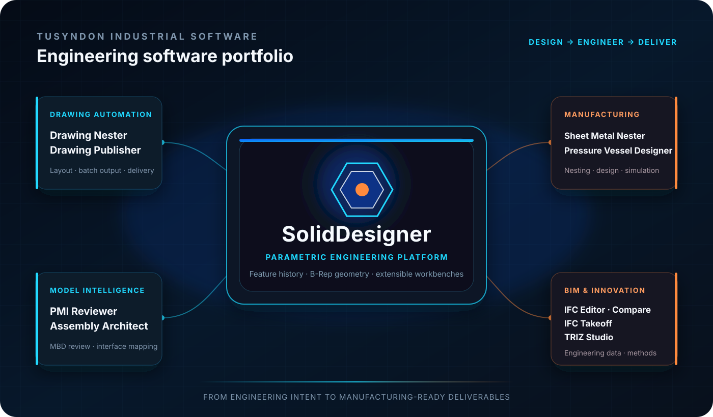
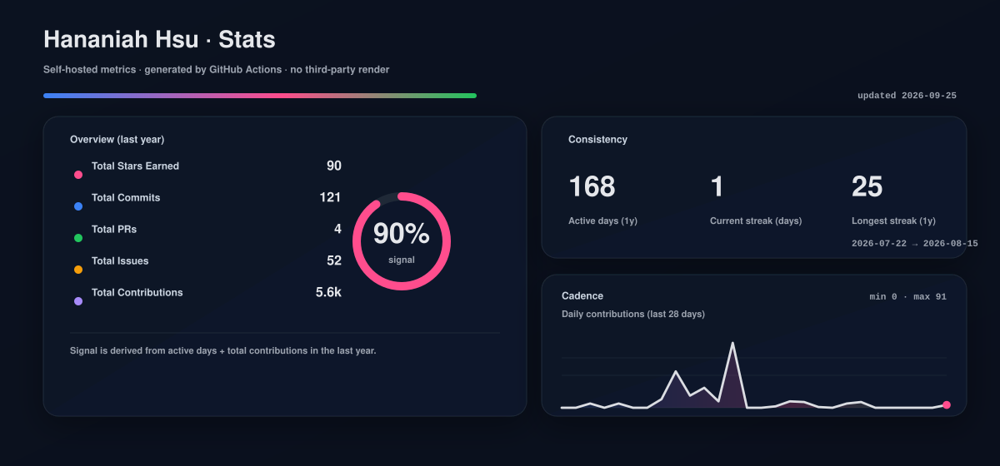

  

  <strong>TUSYNDON INDUSTRIAL SOFTWARE</strong> 
  Precision software for product engineering, manufacturing delivery, and BIM data workflows

<h1 align="center">SolidDesigner</h1>

  <strong>Engineering intent, carried from the first constraint to the final deliverable.</strong> 
  An open, engineering-grade platform for history-based parametric CAD and simulation-driven design.

  
  
  
  

  
  
  
  
  
  

  <a href="README.md">English</a> ·
  <a href="README.zh.md">简体中文</a> ·
  <a href="README.ja.md">日本語</a> ·
  <a href="README.fr.md">Français</a> ·
  <a href="README.de.md">Deutsch</a> ·
  <a href="README.es.md">Español</a> ·
  <a href="README.ru.md">Русский</a>

---

## Industrial software, organized as a product system

<table>
  <tr>
    <td width="50%" valign="top">
      <h3>Tusyndon Industrial Software</h3>
      

        Tusyndon develops focused engineering applications for manufacturing enterprises,
        equipment design teams, and engineering delivery teams. The portfolio connects CAD
        drawings, model definition, manufacturing preparation, pressure-vessel engineering,
        and BIM/IFC data workflows.
      

      

        <a href="https://www.tusyndon.com/products"><strong>Explore the commercial product portfolio →</strong></a>
      

    </td>
    <td width="50%" valign="top">
      <h3>SolidDesigner — flagship open platform</h3>
      

        SolidDesigner is the open engineering platform for desktop, workbench-oriented
        parametric CAD. It brings feature history, geometric constraints, OCCT B-Rep
        geometry, engineering data, and product workbenches into one coherent system.
      

      

        <a href="https://github.com/Ludwigstrasse/SolidDesigner"><strong>Enter the SolidDesigner repository →</strong></a>
      

    </td>
  </tr>
</table>

  

## SolidDesigner — the engineering foundation

SolidDesigner is a C++17/20 desktop application built on the reusable **Alice** foundation and the **OpenCascade** geometry kernel. The project is in **active pre-alpha development**: its present codebase establishes the engineering foundation, while advanced CAD, CAE, optimization, and AI-assisted workflows continue to mature.

<table>
  <tr>
    <td width="33%" valign="top">
      <h3>Parametric intent</h3>
      

        Sketch constraints, named dimensions, feature history, dependency-aware regeneration,
        and edit/redefine workflows give engineering changes an explicit model.
      

    </td>
    <td width="33%" valign="top">
      <h3>Engineering geometry</h3>
      

        OCCT-backed B-Rep modeling, persistent object identity, document transactions, and
        multiple geometric representations protect model continuity as designs evolve.
      

    </td>
    <td width="33%" valign="top">
      <h3>Professional workbenches</h3>
      

        A ribbon-driven desktop shell, dockable panels, MDI viewports, commands, and modular
        workbenches support Part, Assembly, Sketch, Drawing, Simulation, and BIM directions.
      

    </td>
  </tr>
</table>

> **Product status:** active development · pre-alpha. Current implementation and public roadmap are documented in the [SolidDesigner repository](https://github.com/Ludwigstrasse/SolidDesigner).

## Tusyndon product portfolio

<table>
  <tr>
    <td width="50%" valign="top">
      <h3>Engineering drawing automation</h3>
      
<strong>Tusyndon Drawing Nester</strong> Automatic Creo drawing layout for higher paper utilization and controlled print queues.

      
<strong>Tusyndon Drawing Publisher</strong> Batch publishing to PDF and DXF with naming rules and delivery-package generation.

    </td>
    <td width="50%" valign="top">
      <h3>Model definition and architecture</h3>
      
<strong>Tusyndon PMI Reviewer</strong> PMI, MBD, GD&amp;T, and datum completeness review with actionable issue reports.

      
<strong>Tusyndon Assembly Architect</strong> Assembly structure, interface relationships, and architecture views for complex equipment.

    </td>
  </tr>
  <tr>
    <td width="50%" valign="top">
      <h3>Manufacturing and design simulation</h3>
      
<strong>Tusyndon Sheet Metal Nester</strong> DXF nesting, material-utilization optimization, and cutting-list preparation.

      
<strong>Tusyndon Pressure Vessel Designer</strong> Parametric vessel design, engineering calculation, and simulation preparation.

    </td>
    <td width="50%" valign="top">
      <h3>BIM data and engineering innovation</h3>
      
<strong>Tusyndon IFC Editor · Compare · Takeoff</strong> IFC viewing, property editing, version comparison, and quantity takeoff.

      
<strong>Tusyndon TRIZ Studio</strong> Structured contradiction analysis and engineering innovation methods.

    </td>
  </tr>
</table>

  <a href="https://www.tusyndon.com/solutions"><strong>Explore engineering solutions</strong></a>
  &nbsp; · &nbsp;
  <a href="https://www.tusyndon.com/industries"><strong>Explore supported industries</strong></a>
  &nbsp; · &nbsp;
  <a href="mailto:sales@tusyndon.com"><strong>Book an engineering demo</strong></a>

## From design intent to engineering delivery

<table>
  <tr>
    <td align="center"><strong>CONSTRAINTS</strong> Sketches · dimensions · rules</td>
    <td align="center">→</td>
    <td align="center"><strong>FEATURE HISTORY</strong> Dependencies · regenerate · redefine</td>
    <td align="center">→</td>
    <td align="center"><strong>B-REP GEOMETRY</strong> Solid · surface · topology</td>
    <td align="center">→</td>
    <td align="center"><strong>ENGINEERING OUTPUT</strong> Drawing · PMI · analysis · manufacturing</td>
  </tr>
</table>

## Explore the engineering work

<table>
  <tr>
    <td width="25%" align="center" valign="top">
      <h3>Source</h3>
      
Inspect the platform and application code.

      <a href="https://github.com/Ludwigstrasse/SolidDesigner"><strong>SolidDesigner →</strong></a>
    </td>
    <td width="25%" align="center" valign="top">
      <h3>Build</h3>
      
Generate the x64 solution and compile with Visual Studio 2022.

      <a href="https://github.com/Ludwigstrasse/SolidDesigner#build--run"><strong>Build guide →</strong></a>
    </td>
    <td width="25%" align="center" valign="top">
      <h3>Architecture</h3>
      
Read public concepts and technical documentation.

      <a href="https://github.com/hananiahhsu/SolidDesignerWiki"><strong>Public wiki →</strong></a>
    </td>
    <td width="25%" align="center" valign="top">
      <h3>Collaborate</h3>
      
Discuss product direction and engineering problems.

      <a href="https://github.com/Ludwigstrasse/SolidDesigner/discussions"><strong>Discussions →</strong></a>
    </td>
  </tr>
</table>

---

  <strong>Build engineering software around real industrial work.</strong> 
  Manufacturing · equipment · automotive · sheet metal · pressure vessels · BIM · robotics · simulation

  <a href="https://www.tusyndon.com/">Company</a> ·
  <a href="https://www.tusyndon.com/products">Products</a> ·
  <a href="https://www.tusyndon.com/solutions">Solutions</a> ·
  <a href="https://github.com/Ludwigstrasse/SolidDesigner">SolidDesigner</a> ·
  <a href="mailto:sales@tusyndon.com">sales@tusyndon.com</a>

  
<strong>GitHub engineering activity</strong>

   
  

    
  

