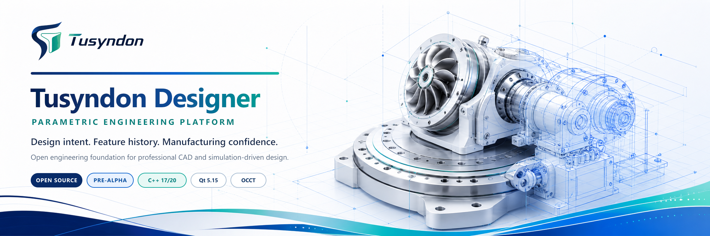
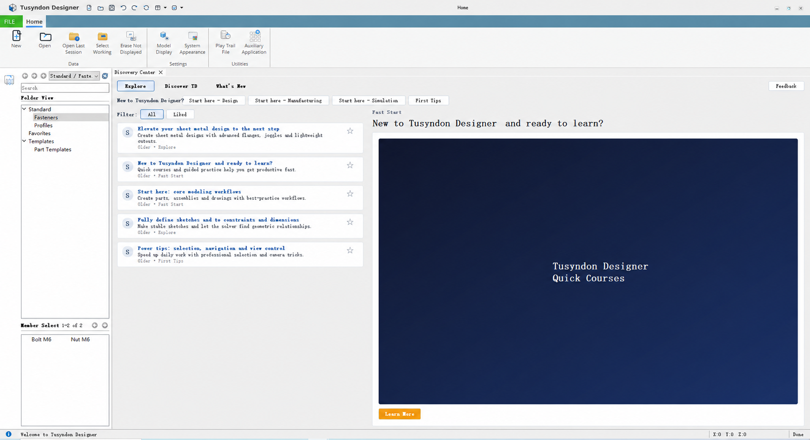

  

  
  
  
  

  <a href="README.md">English</a> · <a href="README.zh.md">简体中文</a> · <a href="README.ja.md">日本語</a> ·
  <a href="README.fr.md">Français</a> · <a href="README.de.md">Deutsch</a> · <a href="README.es.md">Español</a> ·
  <a href="README.ru.md">Русский</a> · <a href="README.hi.md">हिन्दी</a> · <a href="README.th.md">ไทย</a> ·
  <a href="README.vi.md">Tiếng Việt</a> · <a href="README.pt.md">Português</a> · <a href="README.ms.md">Bahasa Melayu</a> ·
  <a href="README.id.md">Bahasa Indonesia</a> · <a href="README.ko.md">한국어</a> · <a href="README.kk.md">Қазақша</a> ·
  <a href="README.mn.md">Монгол</a> · <a href="README.uk.md">Українська</a> · <a href="README.cs.md">Čeština</a> ·
  <a href="README.eu.md">Euskara</a> · <a href="README.ta.md">தமிழ்</a> · <a href="README.bn.md">বাংলা</a>

## உண்மையான தயாரிப்பு மேம்பாட்டிற்கான பொறியியல் மென்பொருள்

**Tusyndon Industrial Software** இயந்திர வடிவமைப்பு, உற்பத்தித் தயாரிப்பு, பொறியியல் வழங்கல் மற்றும் BIM தரவு பணிப்பாய்வுகளுக்கான சிறப்பு பயன்பாடுகளை உருவாக்குகிறது. **Tusyndon Designer** முதன்மையான திறந்த பொறியியல் தளம்—வரலாறு சார்ந்த அளவுரு CAD மற்றும் உருவகப்படுத்தல் வழிநடத்தும் வடிவமைப்பிற்கான டெஸ்க்டாப் பணிமனை அடித்தளம்.

<table>
  <tr>
    <td width="50%" valign="top">
      <h3>வணிகப் பொறியியல் தயாரிப்புகள்</h3>
      
சிறப்பு கருவிகள் வரைபட வழங்கல், மாதிரி மதிப்பாய்வு, அசெம்பிளி கட்டமைப்பு, தகடு உலோகத் தயாரிப்பு, அழுத்தக் கலன் பொறியியல், IFC பணிப்பாய்வுகள் மற்றும் கட்டமைக்கப்பட்ட புதுமையைத் தானியக்கப்படுத்துகின்றன.

      
<a href="https://www.tusyndon.com/products"><strong>Tusyndon தயாரிப்புகளை ஆராய்க →</strong></a>

    </td>
    <td width="50%" valign="top">
      <h3>திறந்த பொறியியல் தளம்</h3>
      
Tusyndon Designer அளவுரு வடிவமைப்பு நோக்கம், OCCT B-Rep வடிவியல், ஆவணப் பரிவர்த்தனைகள், நிலையான பொறியியல் அடையாளம் மற்றும் தொழில்முறை டெஸ்க்டாப் பணிமனைகளை ஒருங்கிணைக்கிறது.

      
<a href="https://github.com/Ludwigstrasse/SolidDesigner"><strong>Tusyndon Designer-ஐ ஆராய்க →</strong></a>

    </td>
  </tr>
</table>

  

## Tusyndon தயாரிப்பு குடும்பங்கள்

<table>
  <tr>
    <td width="50%" valign="top">
      <h3>வரைபடத் தானியக்கம்</h3>
      
<strong>Tusyndon Drawing Nester</strong> Creo வரைபடங்களின் தானியங்கு அமைப்பு, காகிதப் பயன்பாட்டு மேம்பாடு மற்றும் கட்டுப்படுத்தப்பட்ட அச்சு வரிசைகள்.

      
<strong>Tusyndon Drawing Publisher</strong> விதி சார்ந்த PDF மற்றும் DXF தொகுதி வெளியீடு, கட்டமைக்கப்பட்ட வழங்கல் தொகுப்புகள்.

    </td>
    <td width="50%" valign="top">
      <h3>மாதிரி நுண்ணறிவு</h3>
      
<strong>Tusyndon PMI Reviewer</strong> PMI, MBD, GD&amp;T மற்றும் டேட்டம் முழுமை மதிப்பாய்வு, செயல்படுத்தக்கூடிய சிக்கல் அறிக்கைகள்.

      
<strong>Tusyndon Assembly Architect</strong> சிக்கலான உபகரணங்களுக்கான அசெம்பிளி கட்டமைப்புகள், அமைப்பு இடைமுகங்கள் மற்றும் கட்டமைப்புக் காட்சிகள்.

    </td>
  </tr>
  <tr>
    <td width="50%" valign="top">
      <h3>உற்பத்திப் பொறியியல்</h3>
      
<strong>Tusyndon Sheet Metal Nester</strong> DXF நெஸ்டிங், பொருள் பயன்பாட்டு மேம்பாடு மற்றும் வெட்டுப் பட்டியல் தயாரிப்பு.

      
<strong>Tusyndon Pressure Vessel Designer</strong> அளவுரு கலன் வடிவமைப்பு, பொறியியல் கணக்கீடு மற்றும் உருவகப்படுத்தல் தயாரிப்பு.

    </td>
    <td width="50%" valign="top">
      <h3>BIM மற்றும் பொறியியல் புதுமை</h3>
      
<strong>Tusyndon IFC Editor · Compare · Takeoff</strong> IFC பார்வை, பண்பு திருத்தம், பதிப்பு ஒப்பீடு மற்றும் அளவு கணக்கீடு.

      
<strong>Tusyndon TRIZ Studio</strong> கட்டமைக்கப்பட்ட முரண்பாடு பகுப்பாய்வு மற்றும் பொறியியல் புதுமை முறைகள்.

    </td>
  </tr>
</table>

## Tusyndon Designer

<table>
  <tr>
    <td width="42%" valign="top">
      <h3>அளவுரு பொறியியல் தளம்</h3>
      
Tusyndon Designer என்பது மீண்டும் பயன்படுத்தக்கூடிய <strong>Alice</strong> அடித்தளம் மற்றும் <strong>OpenCascade</strong> வடிவியல் கருவில் கட்டப்பட்ட நவீன C++17/20 டெஸ்க்டாப் பயன்பாடாகும்.

      
திட்டம் <strong>செயலில் உள்ள முன்-ஆல்பா மேம்பாட்டில்</strong> உள்ளது. தற்போதைய குறியீடு பயன்பாட்டு உறை, பொறியியல் தரவு அடித்தளம், தொடக்க அம்ச மற்றும் கட்டுப்பாட்டு அமைப்புகள், பரிவர்த்தனை உணர்வுள்ள கட்டளைகள் மற்றும் விரிவாக்கக்கூடிய பணிமனை கட்டமைப்பை நிறுவுகிறது.

      
<a href="https://github.com/Ludwigstrasse/SolidDesigner#build--run"><strong>Visual Studio 2022 மூலம் கட்டமைக்கவும் →</strong></a>

    </td>
    <td width="58%" valign="top" align="center">
      
       தற்போதைய Tusyndon Designer Home Workbench · செயலில் உள்ள முன்-ஆல்பா
    </td>
  </tr>
</table>

  
  
  
  
  
  

## பொறியியல் அடித்தளங்கள்

<table>
  <tr>
    <td width="50%" valign="top"><h3>அளவுரு மாதிரி</h3>
ஸ்கெட்ச் கட்டுப்பாடுகள், பெயரிடப்பட்ட பரிமாணங்கள், அம்சச் சார்புகள், தீர்மானமான மீளுருவாக்கம் மற்றும் திருத்தம் அல்லது மறுவரையறை பணிப்பாய்வுகள் வடிவமைப்பு நோக்கத்தைப் பாதுகாக்கின்றன.
</td>
    <td width="50%" valign="top"><h3>வடிவியல் மற்றும் இடவியல்</h3>
OCCT சார்ந்த B-Rep மாதிரியாக்கம் தொழில்முறை CAD பணிப்பாய்வுகளுக்கான திண்மம், மேற்பரப்பு, இடவியல் மற்றும் காட்சிப்படுத்தல் திறன்களை வழங்குகிறது.
</td>
  </tr>
  <tr>
    <td width="50%" valign="top"><h3>ஆவண ஒருமைப்பாடு</h3>
ஆவணப் பரிவர்த்தனைகள், ObjectId சார்ந்த அடையாளம், நிலையான குறிப்புகள் மற்றும் கட்டளை நிலை செயல்நீக்கம் அல்லது மீள்செயல் மாதிரித் தொடர்ச்சியைப் பாதுகாக்கின்றன.
</td>
    <td width="50%" valign="top"><h3>தொழில்முறை டெஸ்க்டாப்</h3>
ரிப்பன் கட்டளைகள், இணைக்கக்கூடிய பலகைகள், MDI காட்சிகள், தேர்வு, தொடர்பு மற்றும் தொகுதி பணிமனைகள் நீண்டகால தயாரிப்பு வளர்ச்சியை ஆதரிக்கின்றன.
</td>
  </tr>
</table>

## Tusyndon உடன் பணியாற்றுங்கள்

  <strong>உண்மையான பொறியியல் பணிப்பாய்வு, பிரதிநிதி மாதிரி, வரைபடத் தொகுப்பு அல்லது IFC திட்டத்தை வழங்குங்கள்.</strong> 
  உண்மையான உள்ளீடு, செயல்முறை மற்றும் தேவையான வழங்கல்களின் அடிப்படையில் தயாரிப்பு பொருத்தத்தை மதிப்பிடுகிறோம்.

  <a href="https://www.tusyndon.com/solutions"><strong>பொறியியல் தீர்வுகள்</strong></a> &nbsp; · &nbsp;
  <a href="https://www.tusyndon.com/industries"><strong>தொழில்துறைகள்</strong></a> &nbsp; · &nbsp;
  <a href="mailto:sales@tusyndon.com"><strong>தயாரிப்பு செயல்விளக்கத்தை முன்பதிவு செய்க</strong></a> &nbsp; · &nbsp;
  <a href="https://github.com/Ludwigstrasse/SolidDesigner/discussions"><strong>பொறியியல் விவாதங்கள்</strong></a>

---

  <strong>Tusyndon Industrial Software</strong> 
  இயந்திர வடிவமைப்பு · உற்பத்தித் தயாரிப்பு · பொறியியல் வழங்கல் · BIM தரவு  
  <a href="https://www.tusyndon.com/">நிறுவனம்</a> ·
  <a href="https://www.tusyndon.com/products">தயாரிப்புகள்</a> ·
  <a href="https://github.com/Ludwigstrasse/SolidDesigner">Tusyndon Designer</a> ·
  <a href="https://github.com/hananiahhsu/SolidDesignerWiki">பொது விக்கி</a> ·
  <a href="mailto:sales@tusyndon.com">sales@tusyndon.com</a>

  
<strong>GitHub பொறியியல் செயல்பாடு</strong>

   

