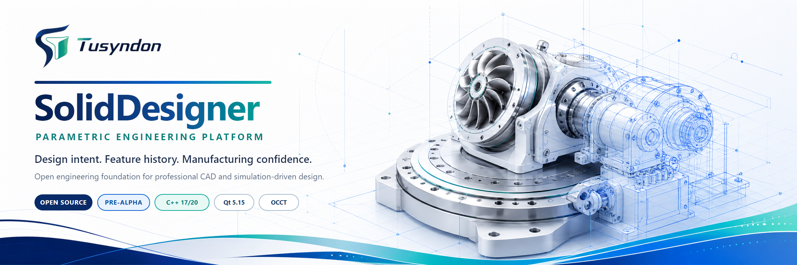
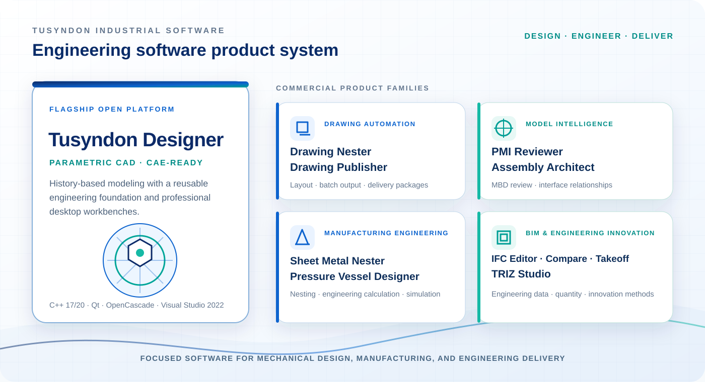
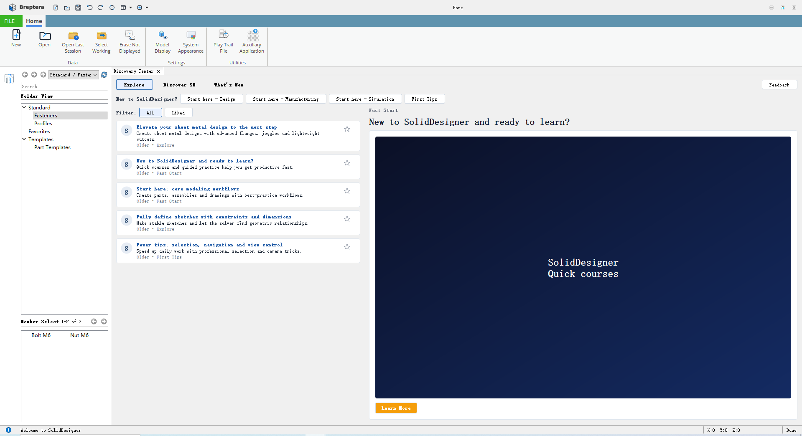

  

  
  
  
  

  <a href="README.md">English</a> · <a href="README.zh.md">简体中文</a> · <a href="README.ja.md">日本語</a> ·
  <a href="README.fr.md">Français</a> · <a href="README.de.md">Deutsch</a> · <a href="README.es.md">Español</a> ·
  <a href="README.ru.md">Русский</a> · <a href="README.hi.md">हिन्दी</a> · <a href="README.th.md">ไทย</a> ·
  <a href="README.vi.md">Tiếng Việt</a> · <a href="README.pt.md">Português</a> · <a href="README.ms.md">Bahasa Melayu</a> ·
  <a href="README.id.md">Bahasa Indonesia</a> · <a href="README.ko.md">한국어</a> · <a href="README.kk.md">Қазақша</a> ·
  <a href="README.mn.md">Монгол</a> · <a href="README.uk.md">Українська</a> · <a href="README.cs.md">Čeština</a> ·
  <a href="README.eu.md">Euskara</a> · <a href="README.ta.md">தமிழ்</a> · <a href="README.bn.md">বাংলা</a>

## Phần mềm kỹ thuật cho công việc phát triển sản phẩm thực tế

**Tusyndon Industrial Software** phát triển các ứng dụng chuyên dụng cho thiết kế cơ khí, chuẩn bị sản xuất, bàn giao kỹ thuật và quy trình dữ liệu BIM. **SolidDesigner** là nền tảng kỹ thuật mở chủ lực: nền tảng máy tính để bàn theo mô hình bàn làm việc dành cho CAD tham số dựa trên lịch sử và thiết kế dẫn dắt bởi mô phỏng.

<table>
  <tr>
    <td width="50%" valign="top">
      <h3>Sản phẩm kỹ thuật thương mại</h3>
      
Các công cụ chuyên dụng tự động hóa việc bàn giao bản vẽ, rà soát mô hình, kiến trúc lắp ráp, chuẩn bị kim loại tấm, thiết kế bình chịu áp, quy trình IFC và đổi mới kỹ thuật có cấu trúc.

      
<a href="https://www.tusyndon.com/products"><strong>Khám phá sản phẩm Tusyndon →</strong></a>

    </td>
    <td width="50%" valign="top">
      <h3>Nền tảng kỹ thuật mở</h3>
      
SolidDesigner kết hợp ý đồ thiết kế tham số, hình học B-Rep OCCT, giao dịch tài liệu, định danh kỹ thuật bền vững và các bàn làm việc chuyên nghiệp.

      
<a href="https://github.com/Ludwigstrasse/SolidDesigner"><strong>Khám phá SolidDesigner →</strong></a>

    </td>
  </tr>
</table>

  

## Các nhóm sản phẩm Tusyndon

<table>
  <tr>
    <td width="50%" valign="top">
      <h3>Tự động hóa bản vẽ</h3>
      
<strong>Tusyndon Drawing Nester</strong> Tự động bố trí bản vẽ Creo, tối ưu sử dụng giấy và kiểm soát hàng đợi in.

      
<strong>Tusyndon Drawing Publisher</strong> Xuất hàng loạt PDF và DXF theo quy tắc với gói bàn giao có cấu trúc.

    </td>
    <td width="50%" valign="top">
      <h3>Trí tuệ mô hình</h3>
      
<strong>Tusyndon PMI Reviewer</strong> Kiểm tra tính đầy đủ của PMI, MBD, GD&amp;T và chuẩn tham chiếu, kèm báo cáo vấn đề có thể xử lý.

      
<strong>Tusyndon Assembly Architect</strong> Cấu trúc lắp ráp, giao diện hệ thống và góc nhìn kiến trúc cho thiết bị phức tạp.

    </td>
  </tr>
  <tr>
    <td width="50%" valign="top">
      <h3>Kỹ thuật sản xuất</h3>
      
<strong>Tusyndon Sheet Metal Nester</strong> Xếp lồng DXF, tối ưu sử dụng vật liệu và chuẩn bị danh sách cắt.

      
<strong>Tusyndon Pressure Vessel Designer</strong> Thiết kế bình tham số, tính toán kỹ thuật và chuẩn bị mô phỏng.

    </td>
    <td width="50%" valign="top">
      <h3>BIM và đổi mới kỹ thuật</h3>
      
<strong>Tusyndon IFC Editor · Compare · Takeoff</strong> Xem IFC, chỉnh sửa thuộc tính, so sánh phiên bản và bóc tách khối lượng.

      
<strong>Tusyndon TRIZ Studio</strong> Phân tích mâu thuẫn có cấu trúc và các phương pháp đổi mới kỹ thuật.

    </td>
  </tr>
</table>

## SolidDesigner

<table>
  <tr>
    <td width="42%" valign="top">
      <h3>Nền tảng kỹ thuật tham số</h3>
      
SolidDesigner là ứng dụng máy tính để bàn C++17/20 hiện đại, xây dựng trên nền tảng tái sử dụng <strong>Alice</strong> và nhân hình học <strong>OpenCascade</strong>.

      
Dự án đang trong giai đoạn <strong>tiền alpha được phát triển tích cực</strong>. Mã nguồn hiện tại thiết lập khung ứng dụng, nền dữ liệu kỹ thuật, hệ thống tính năng và ràng buộc ban đầu, lệnh nhận biết giao dịch và cấu trúc bàn làm việc có thể mở rộng.

      
<a href="https://github.com/Ludwigstrasse/SolidDesigner#build--run"><strong>Biên dịch bằng Visual Studio 2022 →</strong></a>

    </td>
    <td width="58%" valign="top" align="center">
      
       SolidDesigner / Breptera Home Workbench hiện tại · tiền alpha đang phát triển
    </td>
  </tr>
</table>

  
  
  
  
  
  

## Nền tảng kỹ thuật

<table>
  <tr>
    <td width="50%" valign="top"><h3>Mô hình tham số</h3>
Ràng buộc phác thảo, kích thước có tên, phụ thuộc tính năng, tái tạo xác định và quy trình chỉnh sửa hoặc định nghĩa lại giúp bảo toàn ý đồ thiết kế.
</td>
    <td width="50%" valign="top"><h3>Hình học và tô pô</h3>
Mô hình B-Rep dựa trên OCCT cung cấp khả năng khối, bề mặt, tô pô và trực quan hóa cho quy trình CAD chuyên nghiệp.
</td>
  </tr>
  <tr>
    <td width="50%" valign="top"><h3>Tính toàn vẹn tài liệu</h3>
Giao dịch tài liệu, định danh dựa trên ObjectId, tham chiếu bền vững và hoàn tác hoặc làm lại theo lệnh bảo vệ tính liên tục của mô hình.
</td>
    <td width="50%" valign="top"><h3>Máy tính để bàn chuyên nghiệp</h3>
Lệnh dải băng, bảng ghim, khung nhìn MDI, lựa chọn, tương tác và bàn làm việc mô-đun hỗ trợ phát triển sản phẩm lâu dài.
</td>
  </tr>
</table>

## Hợp tác với Tusyndon

  <strong>Hãy mang đến một quy trình kỹ thuật thực tế, mô hình đại diện, bộ bản vẽ hoặc dự án IFC.</strong> 
  Chúng tôi đánh giá mức độ phù hợp của sản phẩm dựa trên dữ liệu đầu vào, quy trình và sản phẩm bàn giao thực tế.

  <a href="https://www.tusyndon.com/solutions"><strong>Giải pháp kỹ thuật</strong></a> &nbsp; · &nbsp;
  <a href="https://www.tusyndon.com/industries"><strong>Ngành công nghiệp</strong></a> &nbsp; · &nbsp;
  <a href="mailto:sales@tusyndon.com"><strong>Đặt lịch trình diễn</strong></a> &nbsp; · &nbsp;
  <a href="https://github.com/Ludwigstrasse/SolidDesigner/discussions"><strong>Thảo luận kỹ thuật</strong></a>

---

  <strong>Tusyndon Industrial Software</strong> 
  Thiết kế cơ khí · chuẩn bị sản xuất · bàn giao kỹ thuật · dữ liệu BIM  
  <a href="https://www.tusyndon.com/">Công ty</a> ·
  <a href="https://www.tusyndon.com/products">Sản phẩm</a> ·
  <a href="https://github.com/Ludwigstrasse/SolidDesigner">SolidDesigner</a> ·
  <a href="https://github.com/hananiahhsu/SolidDesignerWiki">Wiki công khai</a> ·
  <a href="mailto:sales@tusyndon.com">sales@tusyndon.com</a>

  
<strong>Hoạt động kỹ thuật trên GitHub</strong>

   

